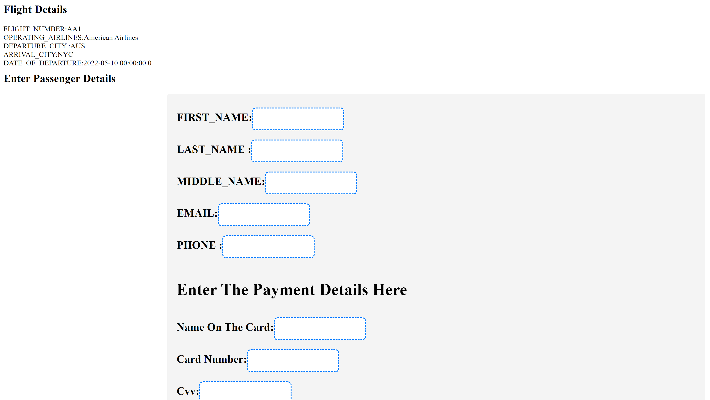

# Flight Reservation and Checking App

This application is a flight reservation and checking system developed using Spring Boot and Java. It allows users to perform various functions related to flight bookings, reservations, and checking flight statuses.

## Features

- **User Authentication**: Secure user authentication system for login/signup functionality.
- **Flight Search**: Search for available flights based on various parameters like destination, date, and time.
- **Booking Management**: Users can make, modify, or cancel flight bookings.
- **Flight Status Checking**: Check the status of a flight using its unique identifier or flight number.
- **Admin Panel**: Admin access for managing flights, schedules, and user data.

## Technologies Used

- **Spring Boot**: Java-based framework for creating standalone, production-grade Spring applications.
- **Java**: Main programming language used for backend development.
- **Spring Security**: Handling authentication and authorization.
- **Hibernate**: Object-relational mapping tool for the backend database.
- **MySQL**: Relational database management system used to store flight and user data.
- **Microservices Architecture**: Utilizes microservices for scalable, modular, and independent service components.

## Installation

1. Clone the repository:
   ```bash
   git clone https://github.com/swatismitabaral-sb/FlightApp.git
   ```

2. Navigate to the project directory:
   ```bash
   cd FlightApp
   ```

3. Set up the database:
   - Configure your MySQL settings in `application.properties`.
   - Run the database migration scripts provided in the project to set up the required tables.

4. Build and run the application:
   ```bash
   ./mvnw spring-boot:run
   ```
   - Also can be run in STS or Intellij-Idea as a SpringBoot Application.

5. Access the application:
   - Open a web browser and go to `http://localhost:8080` to access the application.

## Usage

1. **User Registration/Login**:
   - Sign up for a new account or log in using existing credentials.

2. **Flight Search**:
   - Use the search functionality to find available flights based on destination, date, or time.

3. **Booking Management**:
   - Make new bookings, view existing bookings, modify or cancel bookings as needed.

4. **Flight Status Check**:
   - Check the status of a particular flight using its unique identifier or flight number.

## Microservices

This application utilizes microservices architecture, allowing for scalable and independent services. The different microservices include:
- **Check-in Service**: Handles user authentication and management.
- **Flight Reservation Service**: Manages flight details, bookings, and schedules.

## Screenshots

#### Login Page


#### FindFlights Page


#### Booking Page



#### Check-In Page


## Contributors

- Swatismita Baral (@swatismitabaral-sb)

